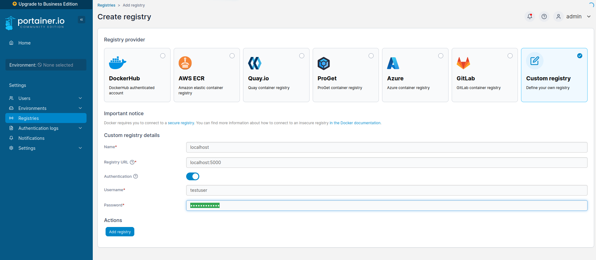
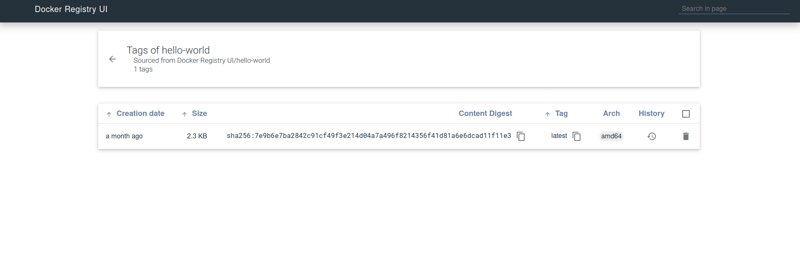

# About

self-hosted registry and portainer for local development with authentication. 

## Registry

From <https://docs.docker.com/registry/deploying/>

### Create a self-signed certificate

From <https://docs.docker.com/registry/insecure/#use-self-signed-certificates>

```bash

$cd registry
$mkdir -p certs

$openssl req \
    -newkey rsa:4096 -nodes -sha256 -keyout certs/domain.key \
    -addext "subjectAltName = DNS:localhost" \
    -x509 -days 365 -out certs/domain.crt
```

As per instructions, add the certificate to your docker daemon trusted certificates.

```bash
sudo mkdir -p /etc/docker/certs.d/localhost:5000
sudo cp ./certs/domain.crt /etc/docker/certs.d/localhost\:5000/ca.crt
```


### Run registry

```bash
docker-compose up -d registry
```

visit <https://localhost:5000/v2/_catalog> and pass `testuser` and `testpassword` as credentials.

### Add registry to portainer



## Pushing images to registry

```bash
docker pull hello-world
docker tag hello-world localhost:5000/hello-world
docker push localhost:5000/hello-world
docker run --rm localhost:5000/hello-world
```



## Optional: basic authentication

From <https://docs.docker.com/registry/deploying/#native-basic-auth>

```bash
cd registry
mkdir auth
docker run \
  --entrypoint htpasswd \
  httpd:2 -Bbn testuser testpassword > auth/htpasswd
```

login with credentials to registry

```bash
cat testpassword password.txt
cat password.txt | docker login -u testuser --password-stdin localhost:5000
```

uncomment `auth` section in `docker-compose.yml` and restart registry

```bash
docker-compose restart registry
```

provide credentials to portainer and everywhere else you want to use the registry.
